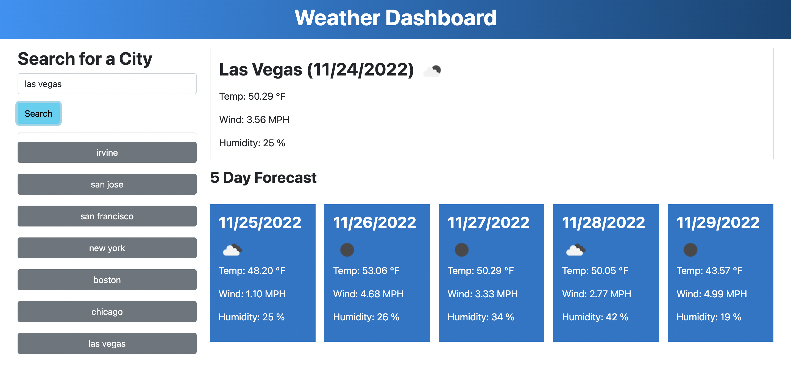

# Module 6 Challenge: Weather Dashboard

## Description

This weather dashboard application was built to allow users to search for any city in the US and view the weather forecast for today and the next 5 days.

## Usage

To use this application, type in the name of any US city and click the Search button. The search history will be displayed on the left side bar. The user can click on any of their past searches to review the weather conditions of that city again.

## Link to Deployed Application
https://nbtrieu.github.io/weather-dashboard/